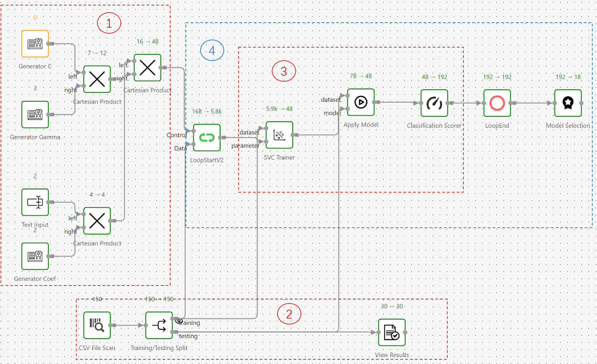

# Workflow

##Block 1 : Generate parameters for training the models

Use Generator to generate linearly spaced values.  

Use Cartesian product  to generate “Grid Search” datasets.  

Use Text input to generate string type parameters. 

The user can also upload a table with the combinations of parameters to be tested instead of generating them.

##Block 2 : Prepare the datasets, perform training testing split.  

Use CSV File Scan to convert source file to Schemas that can be processed through workflow.

Split the datasets into training data and testing data.  

##Block 3 : Model training and testing 

Train the model with training data and one of the given combinations of parameters.

Apply the trained model into testing data and use scorer operator to evaluate its performance.

##Block 4 : loop and selection

The model training and testing process between loop start and loop end will be repeated to test all the combinations of parameters passed to Control Port of Loop Start operator.

Use Model Selection operator to choose the best models from model tuning loops based on the chosen metric.